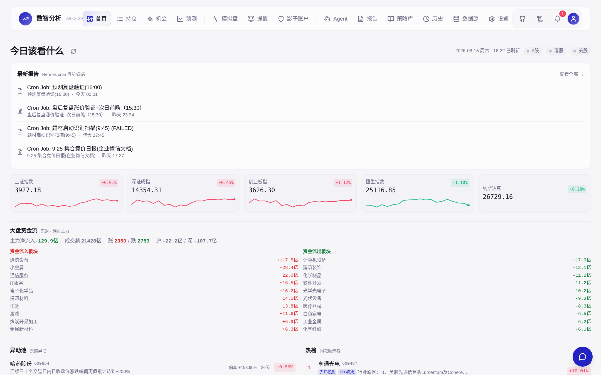
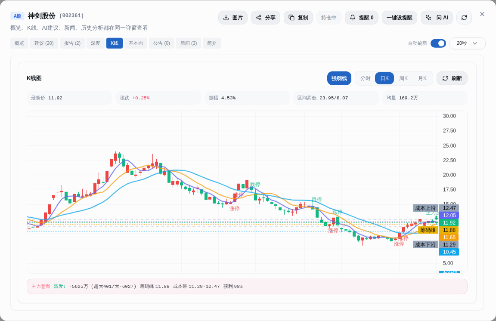
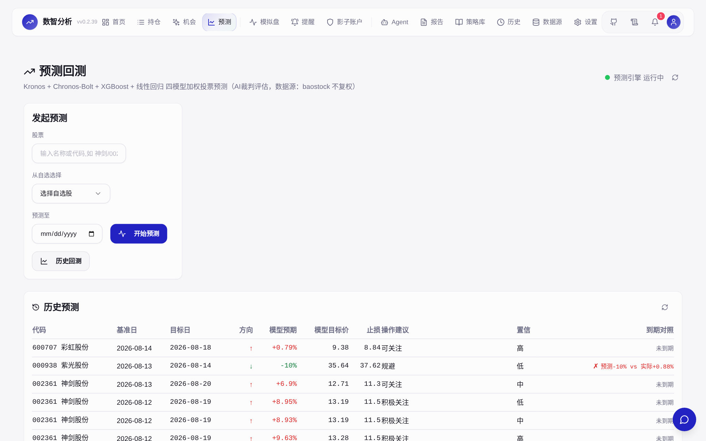
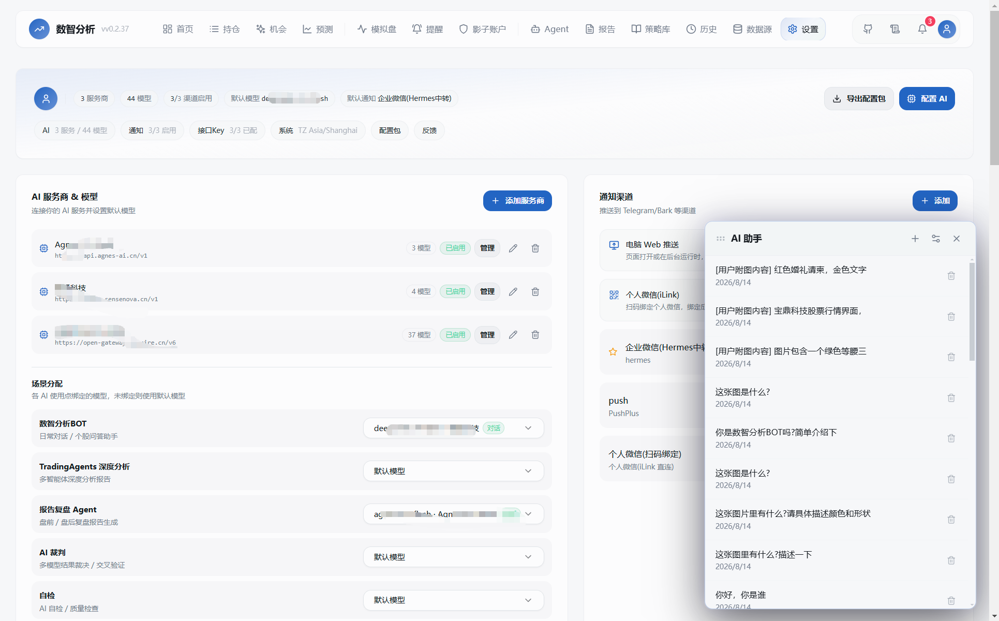
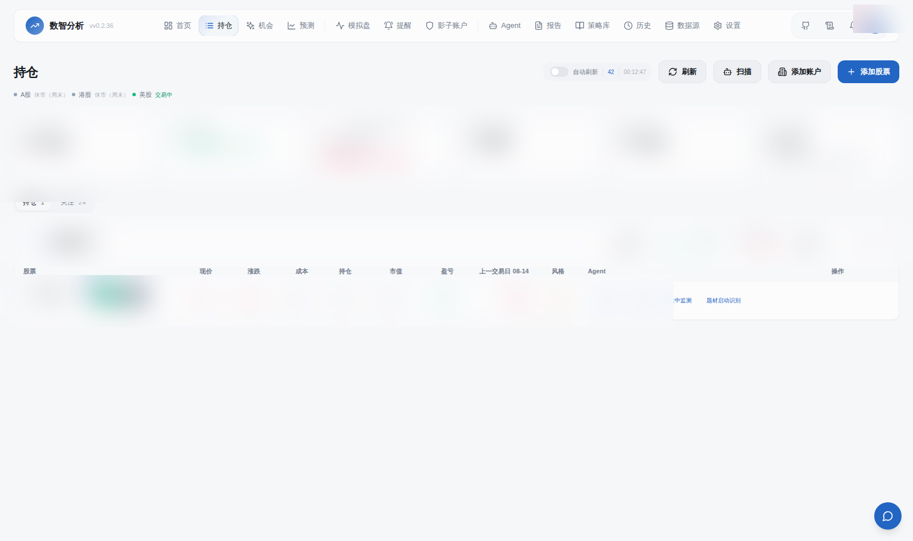

<div align="center">

# 数智分析 Pro · SIDA Pro

**闭源个人股票交易分析平台** — 通达信(.tck/.img/TQ) + 同花顺(thsdk) 双数据源 → 全市场扫描 → K线图层标注 → AI 全数据管家，自托管一体系统。

[](LICENSE)


*Language: [中文](README.zh-CN.md)*

</div>

---

## Why SIDA?

Most A-share tools show you **data**. SIDA closes the loop: it **reads the market, reasons about it with an AI analyst team, predicts it with time-series foundation models, verifies its own predictions against reality, and talks to you on WeChat** — every step traceable, every call auditable.

> **The honest pitch: SIDA is a well-engineered "stitcher" (缝合怪).** Instead of reinventing quant wheels, it wires the best open-source projects — TradingAgents, Kronos, Chronos-Bolt, XGBoost, TA-Lib, TimescaleDB — into one coherent pipeline that actually closes the loop. Each part is proven; the integration is the product.

- 🔍 **Main-force intent analysis** (主力意图) — tick-level order flow: accumulation/distribution detection, order-splitting recognition, support/resistance game — with physics guards that reject implausible readings instead of guessing
- 🔮 **Foundation-model prediction ensemble + verification loop** — Kronos (AAAI 2026) + Chronos-Bolt + XGBoost weighted voting, **weights dynamically adjusted by historical hit rate**, every prediction auto-checked when it expires (hit/miss vs actual returns)
- 🤖 **Multi-agent AI analysis powered by [TradingAgents](https://github.com/TauricResearch/TradingAgents)** — a team of specialized LLM analysts (researchers, bull/bear debaters, traders) that run, argue, and reach conclusions on any stock
- 🏆 **Event-driven opportunity discovery** — 7 strategy signals, tri-engine resonance screening (Wenxiaoda + Wencai + strategy library cross-confirmed), anomaly pool, theme-launch detection — find themes *before* they take off
- 📱 **WeChat two-way dialog** — bind your personal WeChat via iLink protocol, ask about any stock from your phone, receive push reports; multimodal chat understands images, files and links
- 📊 **Auto reports** — pre-market (8:30) / post-market (15:30) reports with real data + AI commentary, generated daily by cron

## 🧩 Built on Open Source

SIDA doesn't reinvent wheels — it integrates proven open-source projects into one pipeline (all wired into the codebase, nothing decorative):

| Project | What SIDA uses it for |
|---|---|
| [TradingAgents](https://github.com/TauricResearch/TradingAgents) | Multi-agent LLM analyst framework behind the AI Agents workspace |
| [Kronos](https://github.com/shiyu-coder/Kronos) (AAAI 2026) | First open K-line foundation model — candlestick forecasting in the ensemble |
| [Chronos-Bolt](https://github.com/amazon-science/chronos-forecasting) | Amazon's time-series foundation model, second model in the ensemble |
| [XGBoost](https://github.com/dmlc/xgboost) · [scikit-learn](https://github.com/scikit-learn/scikit-learn) | Gradient boosting + feature engineering; ensemble weights tuned by hit rate |
| [TA-Lib](https://github.com/ta-lib/ta-lib-python) | Battle-tested technical indicator library |
| [FastAPI](https://github.com/fastapi/fastapi) + SQLAlchemy 2.0 | Async API layer over PostgreSQL |
| [TimescaleDB](https://github.com/timescale/timescaledb) | Time-series hypertable storing multi-source K-lines with fast range queries |
| [Redis](https://github.com/redis/redis) | Two-tier business cache + scheduler leader election (no double-cron in multi-worker deploys) |
| [Lightweight Charts™](https://github.com/tradingview/lightweight-charts) | TradingView-grade candlestick rendering in the browser |
| React 18 + [Vite](https://github.com/vitejs/vite) + [Tailwind CSS](https://github.com/tailwindlabs/tailwindcss) | Frontend toolchain |
| [Prometheus](https://github.com/prometheus/prometheus) · [Grafana](https://github.com/grafana/grafana) · [Loki](https://github.com/grafana/loki) | Metrics, dashboards, log aggregation — one command via `docker-compose.infra.yml` |
| [Playwright](https://github.com/microsoft/playwright) | Headless-browser collection where no clean API exists |
| [akshare](https://github.com/akfamily/akshare) | Open-source China market data interface library |

> One `docker run` boots the app; the observability stack is opt-in infra.

## Screenshots

||||
|:---:|:---:|:---:|
|  |  |  |
|  |  |  |

*Dashboard · K-line + main-force intent · Forecast & verification · Opportunities · AI chat · Paper trading*


## Quick Start

### Docker (recommended)

```bash
# GitHub Container Registry (global) or Aliyun ACR (fast in China)
docker pull ghcr.io/xiaoze-hub/stock-intelligent-data-analytics:latest
# or: docker pull crpi-mte80ai8o78b1429.cn-shanghai.personal.cr.aliyuncs.com/xiaozexwz/xzxwz:v0.4.3

docker run -d --name sida -p 8000:8000 --restart unless-stopped \
  -v sida_data:/app/data \
  -e AUTH_USERNAME=admin \
  -e AUTH_PASSWORD=your_password \
  -e TZ=Asia/Shanghai \
  ghcr.io/xiaoze-hub/stock-intelligent-data-analytics:latest
```

Open http://localhost:8000 — that's it. Optional observability stack: `docker-compose.infra.yml` (Prometheus + Grafana + Loki).

### Development

```bash
# Backend
pip install -r requirements.txt
python server.py

# Frontend
cd frontend && pnpm install && pnpm dev
```

## Architecture

```
┌─────────────┐   ┌──────────────┐   ┌───────────────┐   ┌────────────┐
│ Market data │ → │ AI analysis  │ → │  Prediction   │ → │  Reports   │
│ Tencent/EM/ │   │ main-force   │   │ Kronos+Chronos│   │ pre/post   │
│ THS/auction/│   │ technicals   │   │ +XGB ensemble │   │ auto-gen   │
│ TDX/wencai  │   │ TradingAgents│   │ + AI referee  │   │ + verify   │
└─────────────┘   └──────────────┘   └───────────────┘   └────────────┘
      │                  │                   │                 │
      └──── AI assistant (SIDA Bot) ←────────┘                 │
                    │ image/file/link multimodal               │
                    ▼                                          ▼
            ┌─────────────┐                        ┌────────────────────┐
            │ WeChat push │                        │ PostgreSQL+TSDB ·  │
            │  iLink P2P  │                        │ Redis · Prometheus │
            └─────────────┘                        │ Grafana · Loki     │
                                                   └────────────────────┘
```

## Features Overview

| Module | What you get |
|---|---|
| **Dashboard** | Real-time indices, market breadth, hot boards, sentiment |
| **Stock detail** | K-line, tick-level main-force intent, technicals, events, themes, shareholders |
| **Forecast** | 4-model ensemble + AI adjudicator, expiry-verified hit/miss history |
| **Opportunities** | Event-driven candidates, resonance screening across 3 engines, anomaly pool |
| **Paper trading** | Shadow account, trade-journal parsing, behavior profiling |
| **Reports** | Auto-generated pre/post-market reports, PDF export |
| **Alerts** | Price/condition alerts pushed to your phone |
| **AI Agents** | TradingAgents multi-agent runs with full reasoning traces |

## Multi-user & AI config

- **Account isolation**: positions, watchlists, notification channels, WeChat bindings are per-user
- **Unified LLM config center**: multi-provider model pools, scene bindings (chat/reports/adjudicator/vision…), BYOK-friendly
- **Notification channels**: WeChat (iLink) / WeCom / PushPlus / ServerChan / Email

## Data sources

Tencent / Eastmoney / THS / Sina / TDX (问小达) / Cninfo (互动易) — quotes, K-lines, minute data, capital flow, tick-level trades, auctions, limit-up pools, hot boards, dragon-tiger lists, margin trading and more. Free sources, no paid keys required.

## Disclaimer

This project is for technical research and learning only. All AI-generated analysis, predictions, and reports are for reference only and **do not constitute investment advice**. Markets are risky; invest with caution.

---

## Sponsor

If SIDA helps you, consider buying the author a coffee ☕ — your support keeps this project alive!

| Method | Entry |
|:---:|:---:|
| **WeChat Reward** |  |

> Tip: click ⭐ **Star** on the top-right to support the project.
