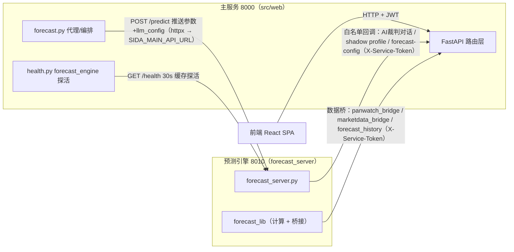

# 服务依赖方向图（W3.6/D5 · 2026-09-09）

> 风险整改方案 D5：8000（主服务）与 8010（预测引擎 forecast_server）依赖必须**单向**。
> 本文是权威依赖图，改动 8000↔8010 通信时必须先改本文再改代码，
> CI 由 `tests/test_w36_dependency_direction.py` 静态守护。

## 拓扑

## 方向规则

1. **编排单向**：任务派发与配置下发只有一条路 —— 8000 经 `POST /predict`
   请求体推送 symbol/days/llm_config；8010 **不再**自行回调 8000 拉配置
   （原 `_detect_panwatch_url` 网关探测 + `/api/providers/services` 回调已删；
   独立进程直接跑 `GET /predict` 时 LLM 配置兜底 `~/.panwatch_forecast.env`）。
2. **白名单回调**（8010→8000，全部 `X-Service-Token` 服务令牌鉴权，
   均为方案 0.0 加固后的既有能力，非本次新建通道）：
   - AI 裁判对话：`ai_referee` 经 panwatch_client 建会话评估预测方向；
   - 影子画像：`GET /api/shadow/profile`（owner 影子报告）；
   - 裁判场景绑定：`GET /api/service/forecast-config`；
   - 数据桥：`panwatch_bridge`（tdx 问询）/ `marketdata_bridge`（龙虎榜）/
     `forecast_history`（实际行情 `/api/klines`）。

   新增回调必须先在本文登记并走评审，不得新建未鉴权通道。
3. **禁止项**（CI 断言，`tests/test_w36_dependency_direction.py`）：
   - 8010 侧（forecast_lib/ + forecast_server.py）：旧环境变量
     `PANWATCH_URL`（已更名 `SIDA_MAIN_API_URL`）；硬编码网关 IP 兜底
     （172.17.0.1 / 172.18.0.1 / 10.8.0.1）；内联硬编码 `http://*:8000`
     拉配置；`import src.*`。
   - 8000 侧：`src/` 禁止 `import forecast_lib`（编排走 HTTP，不走进程内 import）。
4. **优雅降级**：8010 停机不阻塞主服务 —— 8000 预测代理端点返回
   503「预测引擎不可用(需在主机运行 forecast_server.py)」；
   `/api/health` 增加 `components.forecast_engine`（down 时明确反映，
   **不翻转 overall** —— 8010 是可选加速器而非关键路径）。
5. **端点唯一化**（D6）：DDE 唯一入口 `GET /api/thsdk/dde/{symbol}`
   （30s TTL 缓存，thsdk 为限频源）；重复的 `GET /api/thsdk/ext/dde/{symbol}`
   已删（两版响应结构不同且无前端调用方，保留结构更扁平的 canonical 版）。
